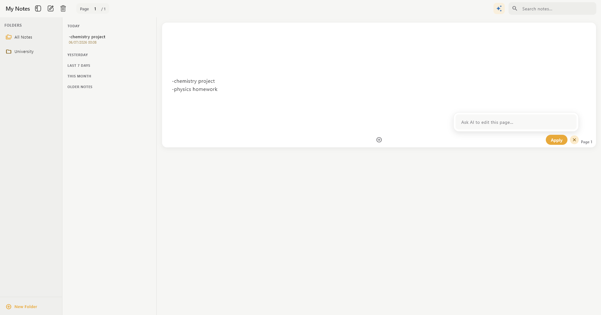
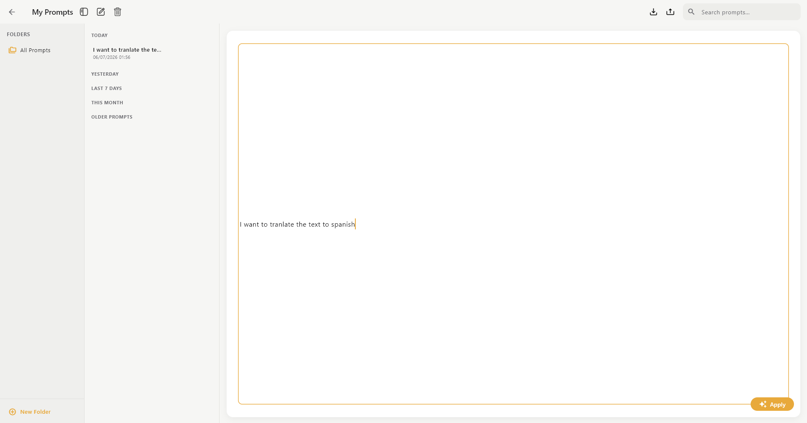
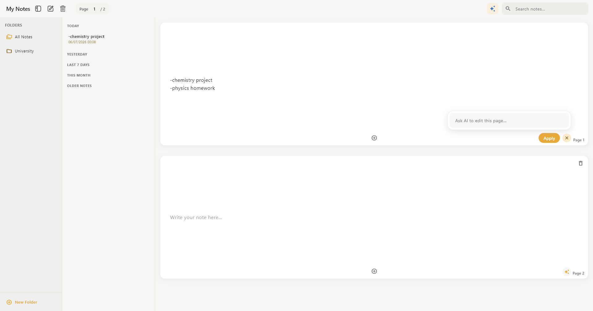
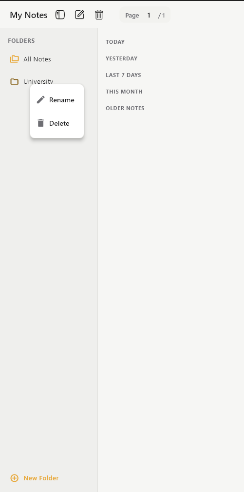
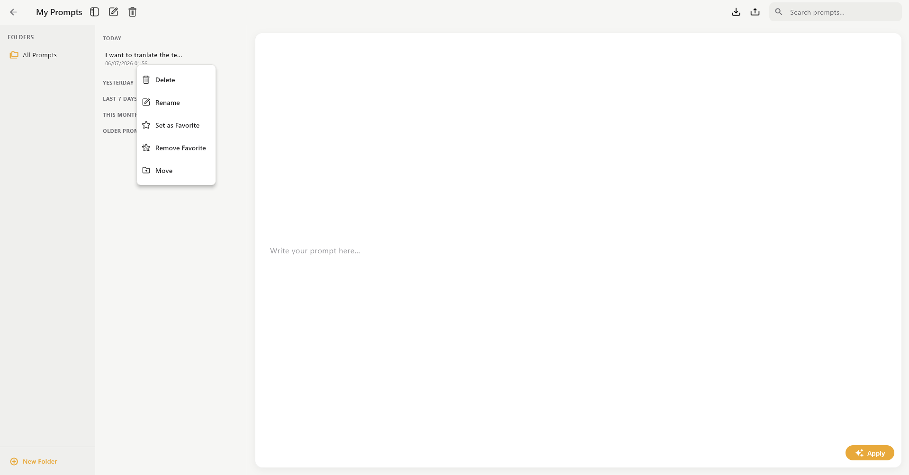

# NotePilot

A Flutter-based desktop notes application that pairs classic note-taking with AI assistance through the OpenAI API. Organize notes and prompts into folders, write multi-page notes, and generate AI responses right inside the app — all backed by a local SQLite database, so everything works offline except the AI calls themselves.

## Table of Contents

- [About the Project](#about-the-project)
  * [Features](#features)
  * [Tech Stack](#tech-stack)
  * [Screenshots](#screenshots)
- [Quick Start](#quick-start)
  * [Prerequisites](#prerequisites)
  * [Installation](#installation)
  * [Running the App](#running-the-app)
- [Repository Structure](#repository-structure)
  * [Architecture Overview](#architecture-overview)
- [Database Structure](#database-structure)
- [Configuration](#configuration)
- [Contributing](#contributing)
  * [Code of Conduct](#code-of-conduct)
- [License](#license)
- [Contact](#contact)

## About the Project

NotePilot is a desktop note-taking app built with Flutter. It's split into two connected workspaces:

- A **Notes** workspace for writing and organizing multi-page notes into folders.
- A **Prompts** workspace for saving, organizing, and reusing AI prompts — with the ability to pin favorites and send any prompt straight to OpenAI's chat completion API.

All data (notes, pages, prompts, and folders) is stored locally in a SQLite database via `sqflite_common_ffi`, so the app works fully offline for note-taking; only the AI chat feature requires network access and an OpenAI API key.

### Features

- **Note Management** – Create, edit, and delete notes, organized into folders. Each note can span multiple pages for longer-form content.
- **Multi-Page Notes** – Add new pages to a note and flip between them with page navigation controls.
- **Folder Organization** – Create, rename, and delete folders for both notes and prompts; move notes/prompts between folders; resizable, collapsible folder/notes panes.
- **Search** – Live search/filtering across notes and across prompts.
- **Prompt Management** – Create, edit, delete, and organize reusable AI prompts into their own folders, separate from notes.
- **Favorite Prompts** – Pin up to three prompts as quick-access favorites.
- **Import / Export Prompts** – Export all prompts and prompt folders to JSON, and re-import them later (via `file_picker`).
- **AI Integration** – Send any note or prompt to OpenAI's `gpt-4o-mini` chat completion endpoint and view the generated response inline.
- **Local Persistent Storage** – Full CRUD for notes, pages, prompts, and folders using a local SQLite database that survives app restarts.
- **Environment-Based Configuration** – API keys are kept out of source control using a `.env` file loaded via `flutter_dotenv`.
- **Cross-Platform Flutter Build** – Project is set up to build for Windows, macOS, Linux, Android, iOS, and web, though it is designed primarily as a desktop notes app.

### Tech Stack

- **Framework:** [Flutter](https://flutter.dev/) / [Dart](https://dart.dev/) (SDK ^3.5.0)
- **Local Database:** SQLite via [`sqflite_common_ffi`](https://pub.dev/packages/sqflite_common_ffi)
- **AI Provider:** [OpenAI API](https://platform.openai.com/docs/api-reference) (`gpt-4o-mini` chat completions) via [`http`](https://pub.dev/packages/http)
- **Environment Config:** [`flutter_dotenv`](https://pub.dev/packages/flutter_dotenv)
- **File Import/Export:** [`file_picker`](https://pub.dev/packages/file_picker)
- **Utilities:** [`intl`](https://pub.dev/packages/intl) (date formatting), [`path_provider`](https://pub.dev/packages/path_provider) (locating the app's documents directory)

### Screenshots

**Notes screen** — folders on the left, a searchable notes list in the middle, and a multi-page note editor with an AI-assist panel on the right.

**Prompts screen** — a favorites bar for pinning quick-access prompts, a prompt-folder sidebar, and a searchable prompt list with import/export controls.

```
assets/screenshots/
├── notes_screen.png
└── prompts_screen.png
└── two_pages_notes_screen.png
└── notes_and_prompts_functionality.png
└── folder_functionality.png
```

```markdown





```

## Quick Start

### Prerequisites

- [Flutter SDK](https://docs.flutter.dev/get-started/install) (Dart SDK ^3.5.0, as set in `pubspec.yaml`)
- A configured desktop target toolchain for whichever platform you build for:
  - **Windows:** Visual Studio with the "Desktop development with C++" workload
  - **macOS:** Xcode
  - **Linux:** the standard Flutter Linux desktop build dependencies (`clang`, `cmake`, `ninja-build`, `pkg-config`, `libgtk-3-dev`)
- An [OpenAI API key](https://platform.openai.com/api-keys) (only required to use the AI chat feature)

### Installation

1. **Clone the repository**

   ```bash
   git clone https://github.com/AzzamElHaffar/NotePilot.git
   cd NotePilot
   ```

2. **Install dependencies**

   ```bash
   flutter pub get
   ```

3. **Set up your environment file**

   The project already includes a `.env` file at the repo root. Open it and add your own OpenAI API key:

   ```env
   OPENAI_API_KEY=your_openai_api_key_here
   ```

   > `.env` is loaded as a Flutter asset (declared in `pubspec.yaml`) and read at runtime via `flutter_dotenv`. Never commit a real API key to a public repository — treat this file as a secret.

4. **Enable desktop support** (if not already enabled for your Flutter install)

   ```bash
   flutter config --enable-windows-desktop   # or --enable-macos-desktop / --enable-linux-desktop
   ```

### Running the App

Run on your current desktop platform:

```bash
flutter run -d windows   # or: -d macos / -d linux
```

Or list available devices/targets first:

```bash
flutter devices
flutter run
```

To build a release binary:

```bash
flutter build windows   # or: macos / linux
```

## Repository Structure

```bash
NotePilot/
├── android/                     # Android platform project (Flutter-generated)
├── ios/                         # iOS platform project (Flutter-generated)
├── linux/                       # Linux desktop platform project
├── macos/                       # macOS desktop platform project
├── windows/                     # Windows desktop platform project
├── web/                         # Web platform project
├── test/                        # Flutter test files
├── lib/
│   ├── main.dart                 # App entry point: loads .env, inits sqflite FFI + database, launches NotesHomePage
│   ├── prompts_ai.dart            # OpenAI chat-completion client (chatWithGpt)
│   ├── controllers/
│   │   ├── notes_controller.dart      # State/business logic for notes, pages, and note folders
│   │   └── prompts_controller.dart    # State/business logic for prompts, prompt folders, and favorites
│   ├── models/
│   │   ├── note.dart              # Note model (id, content, timestamp, title, folderId) + auto-title generation
│   │   ├── pages.dart             # Pages model — individual pages that belong to a multi-page note
│   │   └── prompt.dart            # Prompt model (id, content, timestamp, title, folderId) + auto-title generation
│   ├── screens/
│   │   ├── notes_home_page.dart       # Main Notes UI: folder pane, notes list, multi-page editor, AI panel
│   │   └── prompts_home_page.dart     # Main Prompts UI: favorites bar, prompt folders, prompt list, import/export
│   ├── services/
│   │   └── database_service.dart  # SQLite (sqflite_common_ffi) singleton: schema, migrations, and all CRUD
│   ├── widgets/
│   │   └── show_delete_note_dialog.dart  # Reusable confirmation dialog for deleting a note
│   └── icons/                    # Custom PNG icons used across the UI (add, delete, favorite, export, etc.)
├── .env                          # Environment file holding OPENAI_API_KEY (kept out of version control)
├── .metadata                     # Flutter tooling metadata (auto-generated, do not edit by hand)
├── analysis_options.yaml         # Dart/Flutter lint configuration
├── pubspec.yaml                  # Project dependencies and asset declarations
└── pubspec.lock                  # Locked dependency versions
```

### Architecture Overview

- **`main.dart`** initializes the Flutter binding, loads the `.env` file, sets up the `sqflite_common_ffi` database factory (needed for desktop platforms), initializes the local database, and launches `NotesHomePage`.
- **`DatabaseService`** (in `services/`) is a singleton wrapping a single SQLite database file (`notes_with_ai.db`, stored in the app's documents directory). It owns schema creation/versioned migrations and every CRUD operation for notes, pages, folders, prompts, prompt folders, and favorite prompts.
- **Controllers** (`notes_controller.dart`, `prompts_controller.dart`) sit between the UI and `DatabaseService`, exposing higher-level operations (loading, filtering, folder moves, favorites) that the screens call into.
- **Screens** (`notes_home_page.dart`, `prompts_home_page.dart`) are the two main stateful UI surfaces. `NotesHomePage` is the app's home screen and can navigate into `PromptsHomePage`.
- **`prompts_ai.dart`** is a small, standalone client that sends a prompt string to OpenAI's `/v1/chat/completions` endpoint (model `gpt-4o-mini`) using the API key from `.env`, and returns the model's text response — used by both the note AI-assist panel and the prompts workspace.

## Database Structure

The app uses a single local **SQLite** database (`notes_with_ai.db`), managed by `DatabaseService` with versioned migrations (currently schema version `6`). All tables use `AUTOINCREMENT` integer primary keys.

| Table | Columns | Purpose |
| --- | --- | --- |
| `notes` | `id`, `content`, `timestamp`, `title`, `folder_id` (FK → `folders.id`) | Stores each note's metadata; a note's actual body lives across its `pages`. `title` auto-generates from the first line of content if not set. |
| `folders` | `id`, `name` | Folders used to organize `notes`. |
| `pages` | `id`, `content`, `timestamp`, `pageindex`, `note_id` (FK → `notes.id`) | Individual pages belonging to a multi-page note, ordered by `pageindex`. |
| `prompts` | `id`, `content`, `timestamp`, `title`, `folder_id` (FK → `prompt_folders.id`) | Stores saved AI prompts, separate from notes. |
| `prompt_folders` | `id`, `name` | Folders used to organize `prompts`. |
| `favorite_prompts` | `id`, `prompt_id` (FK → `prompts.id`, nullable) | Exactly three fixed rows (`id` 1–3) representing the three pinnable favorite-prompt slots. |

**Schema migration history** (handled in `DatabaseService.initDatabase`):

| Version | Change |
| --- | --- |
| 2 | Added `title` column to `notes` |
| 3 | Added `folders` table; added `folder_id` to `notes` |
| 4 | Added `pages` table |
| 5 | Added `prompts` and `prompt_folders` tables |
| 6 | Added `favorite_prompts` table, seeded with 3 empty slots |

**Relationships:**

```
folders (1) ───< notes (1) ───< pages
prompt_folders (1) ───< prompts (1) ───< favorite_prompts
```

## Configuration

| Variable | Location | Description |
| --- | --- | --- |
| `OPENAI_API_KEY` | `.env` (repo root) | Your OpenAI API key, loaded at runtime via `flutter_dotenv` and used by `prompts_ai.dart` to authenticate chat-completion requests. |

## Contributing

Contributions are welcome! To contribute:

1. **Fork the repository**
2. **Clone your fork**

   ```bash
   git clone https://github.com/<your-username>/NotePilot.git
   ```

3. **Create a feature branch**

   ```bash
   git checkout -b feat/your-feature-name
   ```

4. **Make your changes**, then verify the app still builds and runs (`flutter analyze`, `flutter test`, `flutter run`).
5. **Use clear, conventional commit messages** (`feat:`, `fix:`, `docs:`, `refactor:`).
6. **Push your branch and open a Pull Request** with a clear description of the change and, if applicable, screenshots.

### Code of Conduct

- Be respectful, kind, and patient when interacting with others.
- Welcome feedback and engage in constructive discussion.
- Avoid discriminatory or offensive language.
- Focus on collaboration and problem-solving rather than criticism.
- Credit other contributors where due.

## License

No license has been specified for this project yet. Until one is added, all rights are reserved by the author.

## Contact

**Azzam El Haffar** – [GitHub Profile](https://github.com/AzzamElHaffar)

Project Repository: [Notes-with-AI](https://github.com/AzzamElHaffar/NotePilot)
